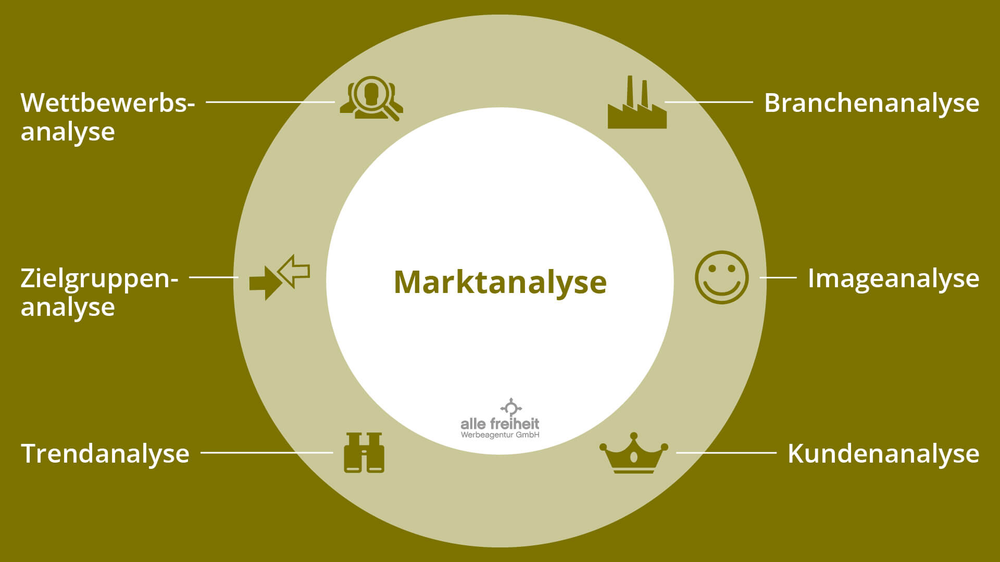

+++
title = "Markt- und Kundenanalyse"
date = "2022-09-20"
draft = false
pinned = false
tags = []
image = "csm_viktualienmarkt-muenchen-c-shutterstock.com-2640_1ae74cd03b.jpg"
description = "Will man sein eigenes Start-up gründen, muss einiges im voraus planen. Vieles davon wird in der Markt- und Kundenanalyse gemacht.  "
footnotes = "Theo"
+++
Der Markt ist einer der wichtigsten Sachen der heutigen Zeit und er ist überall vorhanden.

Der Markt hängt sehr stark von dem Produkt oder Dienstleistung welches angeboten wird. Zu beginn sollte man seinen Markt möglichst breit annehmen und dann immer detaillierter werden. 

Will man zum Beispiel Skateboards verkaufen, würde man an Kinder denken. Aber darf nicht vergessen das Eltern, Brüder oder auch Onkel und Tanten ein Skateboard kaufen würde um es zu verschenken. 

Man befasst sich also mit der Frage "wer könnte alles mein Produkt kaufen und verwenden?" 

Sobald man diese Frage beantwortet hat, kann man mit der Marksegmentierung beginnen. Mit der Marksegmentierung kann den Markt in verschiedene Kriterien aufteilen. 

z.B nach Kundentyp oder Geographie.

Würde man ein Online-Handel betreiben, kann man diese Kategorie in weiter Kriterien aufteilen. Man könnte eine Webseite machen oder eine App. Danach kann man sich die Frage stellen welches Betriebssystem man verwenden will. (Ios, Android oder Windows) So kann man den Markt besser definieren.

Danach kann man eine Marktanalyse machen. Man fragt sich wie alt sind die Kunden. Wie viel Einkommen haben sie? Was für einen Job betätigen sie? Diese Daten kann man von Statistiken rauslesen.

Will man ein passendes Produkt anbieten ist die Kundenanalyse sehr hilfreich. Am besten macht man eine Umfrage. So kann man die Kunden am besten ansprechen.

Mit diesen Kenntnissen könnt ihr jetzt viel besser euer Start-up planen und werdet auch viel weniger Fehler begehen.